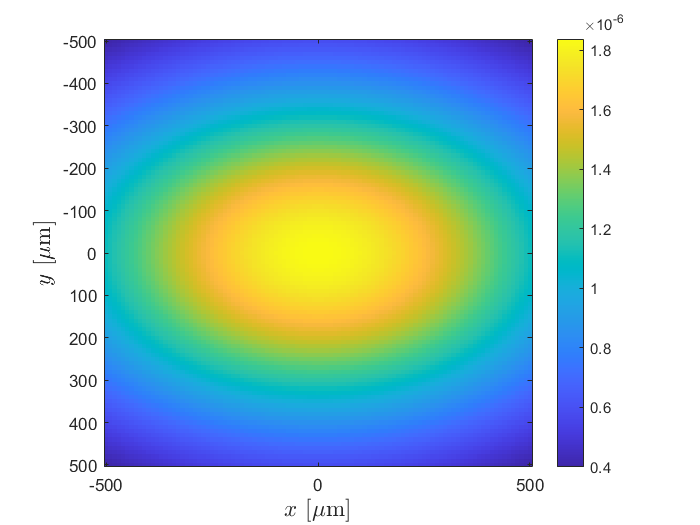
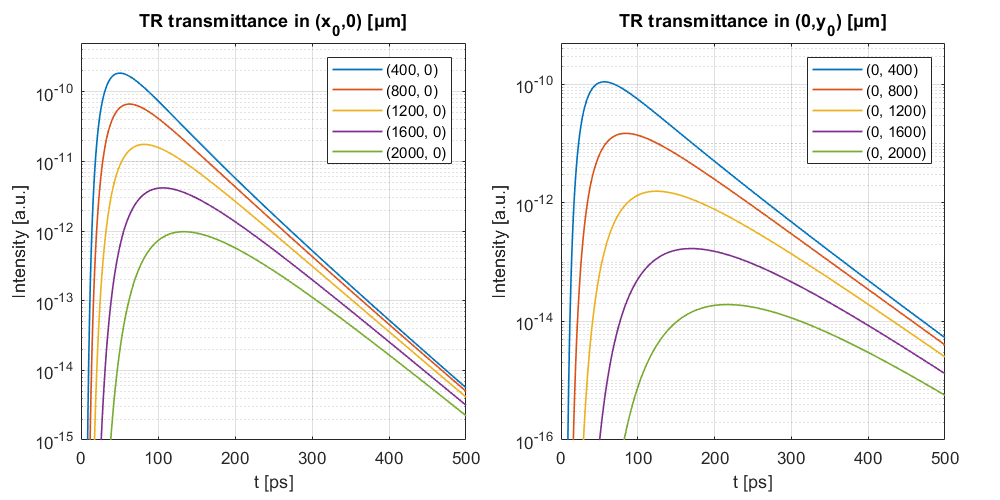

# Anisotropic Diffusive Equation MATLAB functions

A collection of utility functions returning solutions to the Anisotropic Diffusive Equation (ADE) in a scattering slab for different configurations (time- and/or space-resolved reflectance/transmittance).
The slab is indefinitively extended in the xy plane, while z is the beam direction of incidence.
A series of example files are provided for different kinds of measurements.

This repository is provided as a supplement to our work on "Diffusion of light in structurally anisotropic media with uniaxial symmetry", DOI: [10.1103/PhysRevResearch.6.023051](https://doi.org/10.1103/PhysRevResearch.6.023051)

In addition to the uniaxial-symmetric case described in the paper, following a numerical integration scheme the functions provide the ADE solution for the more general case of complete 3D anisotropy ($`\ell_x \neq \ell_y \neq \ell_z`$), mismatch refractive index at the boundaries and homogeneous absorption.

Cite as: 
> E. Pini, F. Martelli, A. Gatto, H. Schäfer, D.S. Wiersma and L. Pattelli (2024). Diffusion of light in structurally anisotropic media with uniaxial symmetry, [*PhysRevResearch.6.023051*](https://doi.org/10.1103/PhysRevResearch.6.023051)

## Example: Space-resolved transmittance in an anisotropic slab

```matlab
L = 1000;         % slab thickness [μm]
n_in = 1.3;       % internal refractive index
n_ext = 1;        % external refractive index
mua = 3e-5;       % absorption coeff. [1/μm]
lx = 30;          % scattering mean free path along x [μm]
ly = 10;          % scattering mean free path along Y [μm]
lz = 20;          % scattering mean free path along z [μm]
x = -2000:50:2000;  % define spatial grid for frame
y = -2000:50:2000;

Txy = Txy_ADE(x, y, L, n_in, n_ext, lx, ly, lz, mua) * mean(diff(x)) * mean(diff(y));

imagesc(x, y, Txy.')
colorbar
ylabel('y [μm]')
xlabel('x [μm]')
axis equal tight
set(gca,'ColorScale','log')
```



## Example: Time-resolved transmittance at different locations in an anisotropic slab

```matlab
L = 1000;                   % slab thickness [μm]
n_in = 1.3;                 % internal refractive index
n_ext = 1;                  % external refractive index
mua = 3e-5;                 % absorption coeff. [1/μm]
lx = 30;                    % scattering mean free path along x [μm]
ly = 10;                    % scattering mean free path along Y [μm]
lz = 20;                    % scattering mean free path along z [μm]
t = 0:500;                  % array of times [ps]
x = linspace(400, 2000, 5); % define positions of collection [μm]
y = linspace(400, 2000, 5); % define positions of collection [μm]
sx = 10;                    % set standard deviation a t = 0 along x [μm]
sy = 10;                    % set standard deviation a t = 0 along y [μm]

figure()
x0 = 350;
y0 = 60;
width = 800;
height = 400;
set(gcf,'position',[x0,y0,width,height])
tile = tiledlayout(1,2);
tile.Padding = 'compact';
tile.TileSpacing = 'compact';

% Transmittance moving along x
nexttile, hold on, grid on, box on
title('TR transmittance in (x_0,0) [μm]')
legend_entries = cell(1, length(x));
for i = 1:length(x)
    Txyt = squeeze(Txyt_ADE(x(i), 0, t, L, n_in, n_ext, lx, ly, lz, sx, sy, mua))*mean(diff(t));
    plot(t, Txyt)
    legend_entries{i} = sprintf('(%g, 0)', x(i));
end
set(gca, 'yscale', 'log')
ylabel('Intensity [a.u.]')
xlabel('t [ps]')
axis([0 max(t) 5e-15 5e-10])
legend(legend_entries, 'Location', 'northeast')

% Transmittance moving along y
nexttile, hold on, grid on, box on
title('TR transmittance in (0,y_0) [μm]')
legend_entries = cell(1, length(y));
for i = 1:length(y)
    Txyt = squeeze(Txyt_ADE(0, y(i), t, L, n_in, n_ext, lx, ly, lz, sx, sy, mua))*mean(diff(t));
    plot(t, Txyt)
    legend_entries{i} = sprintf('(0, %g)', y(i));
end
set(gca, 'yscale', 'log')
ylabel('Intensity [a.u.]')
xlabel('t [ps]')
axis([0 max(t) 5e-16 5e-10])
legend(legend_entries, 'Location', 'northeast')
```


