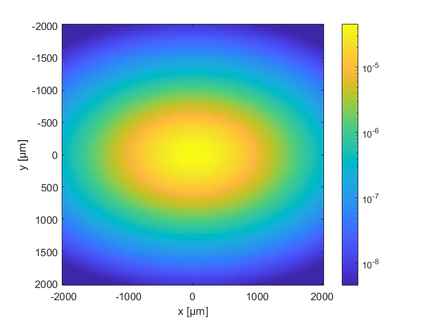

# Anisotropic Diffusive Equation MATLAB functions

A collection of utility functions returning solutions to the Anisotropic Diffusive Equation (ADE) in a scattering slab for different configurations (time- and/or space-resolved reflectance/transmittance).
The slab is indefinitively extended in the xy plane, while z is the beam direction of incidence.
A series of example files are provided for different kinds of measurements.

This repository is provided as a supplement to our work on "Diffusion of light in structurally anisotropic media with uniaxial symmetry", DOI: [10.1103/PhysRevResearch.6.023051](https://doi.org/10.1103/PhysRevResearch.6.023051)

In addition to the uniaxial-symmetric case described in the paper, following a numerical integration scheme the functions provide the ADE solution for the more general case of complete 3D anisotropy ($`\ell_x \neq \ell_y \neq \ell_z`$), mismatch refractive index at the boundaries and homogeneous absorption.

Cite as: 
> E. Pini, F. Martelli, A. Gatto, H. Schäfer, D.S. Wiersma and L. Pattelli (2024). Diffusion of light in structurally anisotropic media with uniaxial symmetry, [*PhysRevResearch.6.023051*](https://doi.org/10.1103/PhysRevResearch.6.023051)

## Example: Space-resolved transmittance in an anisotropic slab

```matlab
L = 1000;         % slab thickness [μm]
n_in = 1.3;       % internal refractive index
n_ext = 1;        % external refractive index
mua = 3e-5;       % absorption coeff. [1/μm]
lx = 30;          % scattering mean free path along x [μm]
ly = 10;          % scattering mean free path along Y [μm]
lz = 30;          % scattering mean free path along z [μm]
x = -500:10:500;  % define spatial grid for frame
y = -500:10:500;

Txy = Txy_ADE(x, y, L, n_in, n_ext, lx, ly, lz, mua) * mean(diff(x)) * mean(diff(y));

imagesc(x, y, Txy.')
colorbar
ylabel('y [μm]')
xlabel('x [μm]')
axis equal tight
```


