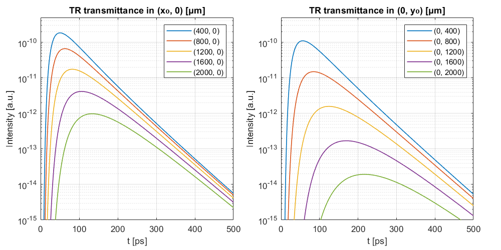

# Anisotropic Diffusive Equation MATLAB functions

A collection of utility functions returning solutions to the Anisotropic Diffusive Equation (ADE) in a scattering slab for different configurations (time- and/or space-resolved reflectance/transmittance).
The slab is indefinitively extended in the xy plane, while z is the beam direction of incidence.
A series of example files are provided for different kinds of measurements.

This repository is provided as a supplement to our work on "Diffusion of light in structurally anisotropic media with uniaxial symmetry", DOI: [10.1103/PhysRevResearch.6.023051](https://doi.org/10.1103/PhysRevResearch.6.023051)

In addition to the uniaxial-symmetric case described in the paper, following a numerical integration scheme the functions provide the ADE solution for the more general case of complete 3D anisotropy ($`\ell_x \neq \ell_y \neq \ell_z`$), mismatch refractive index at the boundaries and homogeneous absorption.

Cite as: 
> E. Pini, F. Martelli, A. Gatto, H. Schäfer, D.S. Wiersma and L. Pattelli (2024). Diffusion of light in structurally anisotropic media with uniaxial symmetry, [*PhysRevResearch.6.023051*](https://doi.org/10.1103/PhysRevResearch.6.023051)

## Example: Time- and space-resolved transmittance in an anisotropic slab

```matlab
L = 1000;                   % slab thickness [μm]
n_in = 1.3;                 % internal refractive index
n_ext = 1;                  % external refractive index
mua = 3e-5;                 % absorption coeff. [1/μm]
lx = 30;                    % scattering mean free path along x [μm]
ly = 10;                    % scattering mean free path along Y [μm]
lz = 20;                    % scattering mean free path along z [μm]
t = linspace(1, 501, 100);  % array of times [ps]
x = -2000:50:2000;          % define spatial grid for frames [μm]
y = -2000:50:2000;

Txyt = Txyt_ADE(x, y, t, L, n_in, n_ext, lx, ly, lz, sx, sy, mua) * mean(diff(t)) * mean(diff(x)) * mean(diff(y));

for i = 1:length(t)
    figure(1)
    imagesc(x, y, Txyt(:,:,i));
    axis equal tight
    set(gca, 'XTickLabel', [], 'YTickLabel', []);
    title(sprintf('Transmittance at t = %.f ps', t(i)), 'interpreter', 'latex', 'FontSize', 16)
end
```


## Example: Space-resolved transmittance in an anisotropic slab

```matlab
L = 1000;         % slab thickness [μm]
n_in = 1.3;       % internal refractive index
n_ext = 1;        % external refractive index
mua = 3e-5;       % absorption coeff. [1/μm]
lx = 30;          % scattering mean free path along x [μm]
ly = 10;          % scattering mean free path along Y [μm]
lz = 20;          % scattering mean free path along z [μm]
x = -2000:50:2000;  % define spatial grid for frame [μm]
y = -2000:50:2000;

Txy = Txy_ADE(x, y, L, n_in, n_ext, lx, ly, lz, mua) * mean(diff(x)) * mean(diff(y));

imagesc(x, y, Txy.')
colorbar
ylabel('y [μm]')
xlabel('x [μm]')
axis equal tight
set(gca,'ColorScale','log')
```


## Example: Time-resolved transmittance at different locations in an anisotropic slab

```matlab
L = 1000;                   % slab thickness [μm]
n_in = 1.3;                 % internal refractive index
n_ext = 1;                  % external refractive index
mua = 3e-5;                 % absorption coeff. [1/μm]
lx = 30;                    % scattering mean free path along x [μm]
ly = 10;                    % scattering mean free path along Y [μm]
lz = 20;                    % scattering mean free path along z [μm]
t = 0:500;                  % array of times [ps]
x = linspace(400, 2000, 5); % define positions of collection [μm]
y = linspace(400, 2000, 5); % define positions of collection [μm]
sx = 10;                    % std dev at t = 0 along x [μm]
sy = 10;                    % std dev at t = 0 along y [μm]

Txyt_x = squeeze(Txyt_ADE(x, 0, t, L, n_in, n_ext, lx, ly, lz, sx, sy, mua)) * mean(diff(t));
Txyt_y = squeeze(Txyt_ADE(0, y, t, L, n_in, n_ext, lx, ly, lz, sx, sy, mua)) * mean(diff(t));

figure('Position', [350, 60, 800, 400])
tiledlayout(1, 2, 'Padding', 'compact', 'TileSpacing', 'compact')

nexttile, hold on, grid on, box on
title('TR transmittance in (x₀, 0) [μm]')
plot(t, Txyt_x, 'LineWidth', 1)
set(gca, 'YScale', 'log')
xlabel('t [ps]'), ylabel('Intensity [a.u.]')
axis([0 max(t) 1e-15 5e-10])
legend(arrayfun(@(xi) sprintf('(%.0f, 0)', xi), x, 'UniformOutput', false), 'Location', 'northeast')

nexttile, hold on, grid on, box on
title('TR transmittance in (0, y₀) [μm]')
plot(t, Txyt_y, 'LineWidth', 1)
set(gca, 'YScale', 'log')
xlabel('t [ps]'), ylabel('Intensity [a.u.]')
axis([0 max(t) 1e-15 5e-10])
legend(arrayfun(@(yi) sprintf('(0, %.0f)', yi), y, 'UniformOutput', false), 'Location', 'northeast')
```


